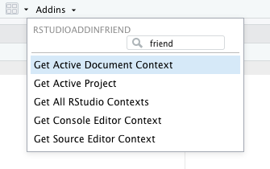

# rstudioAddinFriend

<!-- badges: start -->
<!-- badges: end -->

**rstudioAddinFriend** helps you build RStudio addins. At the moment, this package includes several helpful addins that return active RStudio *contexts* that are available when you run an RStudio addin.

<center></center>

Running one of the _... Context_ addins will call the corresponding function in `rstudioapi` and will save the result to a global variable. For example, running **Get Console Editor Context** runs `rstudioapi::getConsoleEditorContext()` and saves the result to `.consoleEditorContext`.

``` r
## Saving rstudioapi::getConsoleEditorContext() to .consoleEditorContext
str(.consoleEditorContext)
## List of 4
##  $ id       : chr "#console"
##  $ path     : chr ""
##  $ contents : chr ""
##  $ selection:List of 1
##   ..$ :List of 2
##   .. ..$ range: int [1:4] 1 1 1 1
##   .. ..$ text : chr ""
```

Or run **Get All RStudio Context** to run all of the other addins at once.

## Installation

You can install the released version of rstudioAddinFriend from GitHub.

``` r
devtools::install_github("gadenbuie/rstudioAddinFriend")
```
